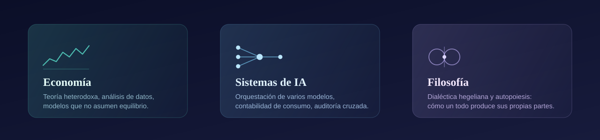

 

Soy economista y analista de datos. Trabajo donde se cruzan tres cosas que suelen
enseñarse por separado: la **teoría económica heterodoxa**, los **sistemas de
inteligencia artificial**, y la pregunta filosófica de **cómo algo llega a
producirse a sí mismo**.

No las vivo como tres intereses distintos. Son la misma pregunta formulada en tres
lenguajes: *cómo un todo genera las partes que a su vez lo reconstituyen.* Hegel lo
llamó el movimiento del concepto. Maturana y Varela lo llamaron autopoiesis. Una
economía lo hace todos los días sin que nadie se lo ordene — y por eso los modelos
que la suponen en equilibrio explican tan poco de lo que de verdad pasa.

 

 

## CAUCE v3

**Multiharness** · *en desarrollo · aún privado*

Un *harness* es el andamiaje que rodea a un modelo de lenguaje: las herramientas que
le das, el bucle en el que lo metes, la memoria que le sostienes. Casi todo el
ecosistema actual consiste en envolver **un** modelo lo mejor posible.

CAUCE v3 parte de otra premisa: **no envolver uno, sino orquestar varios sobre la
misma tarea.**

- **Reparte según rendimiento medido, no según reputación.** Cada tipo de trabajo
  —código, razonamiento, redacción, revisión— tiene un perfil distinto, y el sistema
  aprende cuál rinde en cuál.
- **Lleva la contabilidad real del consumo.** Qué se gastó, en qué, y cuánto cupo
  queda antes de chocar contra un límite.
- **Hace que los modelos se auditen entre ellos** antes de dar una respuesta por
  buena. Ninguno es juez de su propio trabajo.

La idea de fondo es la del proyecto de autopoiesis: un sistema que no solo ejecuta,
sino que **observa su propia ejecución y se reorganiza a partir de lo que observa**.
No es una metáfora decorativa; es la especificación.

> Su antecedente público es **[orquesta-ia](https://github.com/SirHegel/orquesta-ia)**,
> donde ya funcionan el routing por tarea, la contabilidad por ventana de cupo y la
> auditoría cruzada entre modelos.

 

## Proyectos públicos

| | |
|---|---|
| **[orquesta-ia](https://github.com/SirHegel/orquesta-ia)** | Orquestador local de varias cuentas de IA. Routing por tipo de tarea, contabilidad de tokens, detección de límites y auditoría cruzada entre modelos. |
| **[bloquitos](https://github.com/SirHegel/bloquitos)** · [jugar](https://sirhegel.github.io/bloquitos/) | Juego de bloques con niveles infinitos. Cero dependencias, base de datos local, modo daltónico y funcionamiento sin conexión. |
| **[designter-financial-bot](https://github.com/SirHegel/designter-financial-bot)** | Asistente de Telegram para gestión financiera automatizada, integrado con Google Sheets. |
| **[colmat-x-automation](https://github.com/SirHegel/colmat-x-automation)** | Publicación automatizada en X con doble seguro contra envíos accidentales. |
| **[automatizacion-evidencias-adso](https://github.com/SirHegel/automatizacion-evidencias-adso)** | Generación, validación y auditoría reproducible de evidencias de desarrollo de software. |
| **[sincategorematico-bot](https://github.com/SirHegel/sincategorematico-bot)** | Bot local de bajo consumo para flujo de noticias y publicación. El nombre viene de la lógica medieval. |

 

## Cómo trabajo

Tres cosas que se repiten en todo lo que escribo, y que se pueden verificar
abriendo cualquiera de los repos de arriba:

**Las credenciales no entran en el repositorio.** Nunca. Cada proyecto tiene dos
modos: una versión pública sin secretos y la configuración real que se queda en el
equipo. Donde hace falta, un escáner corre antes de cada commit y aborta si detecta
algo.

**Lo que afirmo está probado.** Si digo que funciona sin conexión, hay una prueba que
corta la red y lo comprueba. Si digo que no se corrompe, hay una simulación de miles
de partidas verificando el invariante.

**Prefiero cero dependencias cuando se puede.** No por purismo: una cadena de
suministro que no existe no se puede comprometer.

 

## Lo que leo, lo que veo

Hegel, sobre todo. También Nicolás de Cusa y la escolástica, que llegaron antes a
varias intuiciones que solemos atribuir al idealismo alemán. En economía, la
tradición que se niega a tratar el equilibrio como punto de partida.

Y cine. Lynch antes que nadie — el avatar no es casual. Me interesa el cine que
confía en que el espectador aguante un plano largo, por la misma razón por la que me
interesa la filosofía que confía en que el lector aguante un párrafo largo.

 

---

  <em>«Die Eule der Minerva beginnt erst mit der einbrechenden Dämmerung ihren Flug.»</em> 
  La lechuza de Minerva solo levanta el vuelo al caer la noche.

