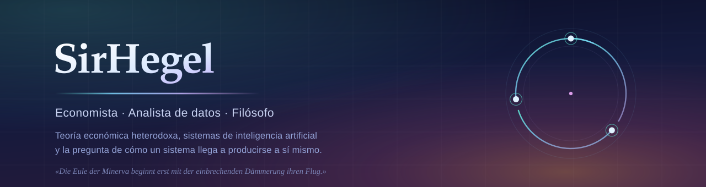
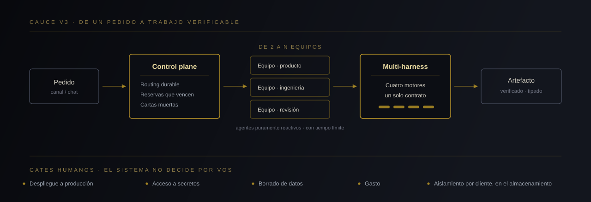

 

Economista y analista de datos. Construyo, junto a **[Steven Vallejo Ortiz](https://www.humanizar.tech/)**,
el sistema que convierte agentes de inteligencia artificial dispersos en una empresa
que opera.

Trabajo con tres materiales que la división académica mantiene separados sin razón:
la crítica de la economía política, la arquitectura de sistemas multiagente, y la
lógica que permite decir cuándo un conjunto de partes constituye una totalidad y
cuándo no pasa de agregado. No son tres campos. Son un mismo problema abordado con
tres instrumentos.

 

## CAUCE V3

**[humanizar.tech](https://www.humanizar.tech/)** — *empresas de desarrollo hechas con agentes*

Un agente no es una empresa. La afirmación no es retórica ni cuantitativa: es
categorial. Sumar agentes no produce una empresa del mismo modo que sumar monedas no
produce capital, ni sumar individuos produce una sociedad política. Lo que constituye
a la empresa es una forma determinada de organización —división del trabajo,
imputación de responsabilidad, gobierno de la capacidad, contabilidad del gasto—, y
esa forma no está contenida en ninguna de sus partes.

El error contrario tiene nombre. Es la sustantivación de lo que sólo existe como
relación: tratar una estructura como si fuera una cosa. Gustavo Bueno lo desmontó en
el *Ensayo sobre las categorías de la economía política*; Luis Carlos Martín Jiménez
lo lleva hasta el final en **[*El mito del capitalismo*](https://www.helicon.es/pen/7848620.htm)**,
donde muestra que «capitalismo» nombra un mito precisamente por operar esa
sustantivación. El mercado actual de la inteligencia artificial repite la operación
en su propio terreno: llama «agente» a un proceso y espera que de su multiplicación
brote una organización.

CAUCE V3 parte de la negación de ese supuesto. No orquesta agentes que ya existen:
**produce los equipos** y les impone la forma que los hace responsables. De dos a N
equipos especializados, gobernados desde un solo plano de control.

Lo que hay dentro, en términos operativos:

| | |
|---|---|
| **Routing durable** | Reservas que vencen y redistribución automática del trabajo cuando un proceso cae. Ninguna tarea queda huérfana porque su ejecutor haya muerto. |
| **Cartas muertas** | Las operaciones fallidas conservan el cuerpo completo del mensaje. Un fallo que no deja rastro no es un fallo: es una pérdida silenciosa. |
| **Multi-harness** | Cuatro motores distintos bajo un único contrato de protocolo. El motor es intercambiable; el contrato, no. |
| **Protocolos tipados** | Campos distintos para respuesta, delegación, notificación y artefacto. Un tipo confundido es una decisión que nadie tomó. |
| **Identidad y aislamiento** | Certificado por cliente y separación en la capa de almacenamiento. Los canales no se hablan entre inquilinos, y no por olvido: por diseño. |
| **Gates humanos** | Despliegue, acceso a secretos, borrado y gasto exigen una persona. El sistema no decide por vos. |

El método es el que Juan Íñigo Carrera exige a cualquier crítica que se pretenda
seria: no representar el proceso desde fuera, sino **reproducir su movimiento**. Un
plano de control no describe la organización — la ejerce, y por eso puede auditarse.

Y la arquitectura es hegeliana en un sentido preciso, no decorativo. No se presupone
la empresa como dato: se parte de la determinación mínima —un pedido en un canal— y
se la deja desarrollarse a través de sus mediaciones hasta el resultado concreto.
Es la exigencia que **Stephen Houlgate** defiende en *The Opening of Hegel's Logic*:
un comienzo sin presupuestos, cuyas categorías no se importan desde fuera sino que
se generan en el propio desarrollo.

 

## Protocolos de seguridad

La seguridad no es una capa que se añade cuando el sistema ya funciona. Es la
restricción que decide qué puede hacer el sistema, y por tanto es anterior.

**Ninguna credencial entra en un repositorio.** Cada proyecto lleva dos modos: la
versión pública, sin secretos, y la configuración real, que no sale del equipo. Donde
importa, un escáner corre antes de cada commit y aborta si detecta un patrón de
credencial o una ruta local. Está en `orquesta-ia` y en `bloquitos`, y la integración
continua rechaza el envío si algo pasa.

**Borrar un secreto de un archivo no lo elimina.** Queda en el historial. La única
reparación válida es reescribir el historial y **rotar la credencial**. Lo segundo no
es opcional; lo primero sin lo segundo es teatro.

**Lo que afirmo está probado.** Si un sistema declara funcionar sin conexión, hay una
prueba que corta la red y lo verifica. Si declara no corromper su estado, hay una
simulación de miles de ciclos comprobando el invariante. Una afirmación sin prueba
que la respalde es una promesa, y las promesas no se despliegan.

 

## Economía

Trabajo la teoría económica desde la tradición que se niega a tomar el equilibrio
como punto de partida, porque el equilibrio no es un hecho: es un supuesto que
decide de antemano lo que el modelo podrá ver.

De la Escuela de Oviedo tomo el aparato categorial: la economía política no se
ordena por magnitudes sino por categorías, y confundir el plano de las magnitudes con
el de las categorías produce mitos operativos —«el capitalismo», «el mercado», «la
tecnología»— que funcionan como sujetos de oraciones donde no hay ningún sujeto.

De Juan Íñigo Carrera tomo la exigencia de método: la crítica no consiste en oponer
un modelo a otro, sino en reproducir en el pensamiento el movimiento real de la
forma que se critica. Quien sólo representa, describe. Quien reproduce, explica.

 

## Repositorios

Ordenados por rigor verificable, no por antigüedad. Las cifras son líneas de código
fuente frente a líneas de prueba, medidas sobre los archivos versionados.

| Repositorio | Qué es | Fuente / prueba |
|---|---|---|
| **[orquesta-ia](https://github.com/SirHegel/orquesta-ia)** | Orquestador local multi-cuenta. Routing por tipo de tarea, contabilidad por ventana de cupo, detección de límite y auditoría cruzada entre modelos. Antecedente público de CAUCE. | 2 819 / 769 · `SECURITY.md` + escáner |
| **[colmat-x-automation](https://github.com/SirHegel/colmat-x-automation)** | Publicación automatizada con doble seguro contra envíos accidentales y estado transaccional. | 2 112 / **1 294** |
| **[bloquitos](https://github.com/SirHegel/bloquitos)** · [jugar](https://sirhegel.github.io/bloquitos/) | Motor de juego sin dependencias: base de datos local, modo daltónico, aplicación de escritorio y funcionamiento sin conexión verificado. | 2 940 / 740 · 2 flujos de CI |
| **[sincategorematico-bot](https://github.com/SirHegel/sincategorematico-bot)** | Servicio local de bajo consumo para flujo de noticias y publicación. El nombre viene de la lógica medieval: sincategoremático es el término que no significa por sí solo, sino por su función en la proposición. | 1 133 / 134 |

 

---

  <em>«Die Eule der Minerva beginnt erst mit der einbrechenden Dämmerung ihren Flug.»</em> 
  Hegel, prefacio a los <em>Principios de la filosofía del derecho</em>

