  <a href="https://www.linkedin.com/in/jhon-alvarez-446257282/"><b>LinkedIn</b></a>
  &nbsp;·&nbsp;
  <a href="https://www.humanizar.tech/"><b>humanizar.tech</b></a>
  &nbsp;·&nbsp;
  <a href="https://sirhegel.github.io/bloquitos/"><b>Live demo</b></a>
  &nbsp;·&nbsp;
  <a href="TIPOGRAFIA.md"><b>Type system</b></a>

 

Economist and data analyst. Together with **[Steven Vallejo Ortiz](https://www.stevenvallejo.com/es)**
I build the system that turns scattered AI agents into a company that actually operates.

I work with three materials that academic convention keeps apart for no good reason:
the critique of political economy, the architecture of multi-agent systems, and the
logic that lets you say when a set of parts constitutes a whole and when it remains a
heap. These are not three fields. They are one problem approached with three
instruments.

 

 

## CAUCE V3

**[humanizar.tech](https://www.humanizar.tech/)** — *development companies, built from agents*

An agent is not a company. The claim is neither rhetorical nor quantitative: it is
categorial. Adding agents no more produces a company than adding coins produces
capital, or adding individuals produces a body politic. What constitutes a company is
a determinate form of organization — division of labour, attribution of
responsibility, governance of capacity, accounting for spend — and that form is
contained in none of its parts.

The opposite error has a name. It is the hypostatizing of what exists only as a
relation: treating a structure as though it were a thing. Gustavo Bueno dismantled it
in *Ensayo sobre las categorías de la economía política*; Luis Carlos Martín Jiménez
carries it through in **[*El mito del capitalismo*](https://www.helicon.es/pen/7848620.htm)**,
where he shows that "capitalism" names a myth precisely because it performs that
hypostasis. Today's AI market repeats the operation on its own ground: it calls a
process an "agent" and expects an organization to emerge from multiplying it.

CAUCE V3 begins by denying that premise. It does not orchestrate agents that already
exist — **it produces the teams** and imposes the form that makes them accountable.
From two to N specialized teams, governed from a single control plane.

| | |
|---|---|
| **Durable routing** | Expiring reservations and automatic redistribution of work when a process dies. No task is orphaned because its executor went down. |
| **Dead letters** | Failed operations retain the complete message body. A failure that leaves no trace is not a failure — it is a silent loss. |
| **Multi-harness** | Four distinct engines under a single protocol contract. The engine is interchangeable; the contract is not. |
| **Typed protocols** | Separate fields for response, delegation, notification and artifact. A confused type is a decision nobody made. |
| **Identity and isolation** | Per-client certificates and separation at the storage layer. Channels do not talk across tenants — not by oversight, by design. |
| **Human gates** | Deployment, secret access, deletion and spend each require a person. The system does not decide for you. |

The method is the one Juan Íñigo Carrera demands of any critique that means to be
serious: not to represent the process from outside, but to **reproduce its movement**.
A control plane does not describe the organization — it exercises it, which is why it
can be audited.

And the architecture is Hegelian in a precise, non-decorative sense. The company is
not presupposed as given: it starts from the minimal determination — a request in a
channel — and is left to develop through its mediations into the concrete result.
This is the requirement **Stephen Houlgate** defends in *The Opening of Hegel's Logic*:
a presuppositionless beginning, whose categories are not imported from outside but
generated in the development itself.

 

## Measured performance

Every figure above is counted over the versioned files of the five production
repositories. Source against test is split by path and by extension: anything under
`test/`, `tests/` or `pruebas/`, or whose filename contains `test`, counts as test.
Nothing is estimated.

 

## Security protocols

Security is not a layer added once the system already works. It is the constraint
that decides what the system may do, and therefore comes first.

**No credential enters a repository.** Every project ships in two modes: the public
version, without secrets, and the real configuration, which never leaves the machine.
Where it matters, a scanner runs before every commit and aborts on a credential
pattern or a local path. Continuous integration rejects the push if anything slips
through.

**Deleting a secret from a file does not remove it.** It stays in history. The only
valid repair is to rewrite history **and rotate the credential**. The second is not
optional; the first without the second is theatre.

**What I claim is tested.** If a system says it works offline, a test cuts the network
and verifies it. If it says it will not corrupt its state, a simulation of thousands
of cycles checks the invariant. A claim with no test behind it is a promise, and
promises do not deploy.

 

## Economics

I work economic theory from the tradition that refuses to take equilibrium as its
starting point, because equilibrium is not a fact: it is an assumption that decides
in advance what the model will be able to see.

From the School of Oviedo I take the categorial apparatus: political economy is not
ordered by magnitudes but by categories, and confusing the plane of magnitudes with
the plane of categories produces operative myths — "capitalism", "the market",
"technology" — that function as the subjects of sentences in which there is no
subject at all.

From Juan Íñigo Carrera I take the demand on method: critique does not consist in
setting one model against another, but in reproducing in thought the real movement of
the form under critique. Whoever only represents, describes. Whoever reproduces,
explains.

 

## Repositories

Ordered by technical difficulty measured against the code, not by age or size.

| Repository | Why it is here | Source / test |
|---|---|---|
| **[automatizacion-evidencias-adso](https://github.com/SirHegel/automatizacion-evidencias-adso)** | A 1,133-line engine that regenerates, validates and audits deliverables. It verifies office documents by unzipping them and reading their XML, exports and checks PDFs, and runs a **privacy audit** over every extracted part of every file. CI blocks the push when it finds a risk. | 8,405 / 341 · blocking CI |
| **[orquesta-ia](https://github.com/SirHegel/orquesta-ia)** | Local multi-account orchestrator: routing by task type, accounting per quota window, limit detection and cross-auditing between models. Public antecedent of CAUCE. | 3,037 / 769 · `SECURITY.md` + scanner |
| **[colmat-x-automation](https://github.com/SirHegel/colmat-x-automation)** | The strongest test discipline of the set: **0.61 lines of test per line of code**. Transactional state, OAuth 1.0a and a double safety against accidental publication. | 2,112 / **1,294** |
| **[sincategorematico-bot](https://github.com/SirHegel/sincategorematico-bot)** | Three surfaces over one core: Telegram bot, local HTTP dashboard and desktop application. Ownership-claim protocol with SHA-256 and expiry; the token lives at `0600` outside the repository. | 1,133 / 134 |
| **[bloquitos](https://github.com/SirHegel/bloquitos)** · [play](https://sirhegel.github.io/bloquitos/) | The widest delivery surface: browser, installable app, desktop executable and local database, without a single external dependency. | 3,011 / 740 · 60 tests |

 

---

  <em>«Die Eule der Minerva beginnt erst mit der einbrechenden Dämmerung ihren Flug.»</em> 
  Hegel, preface to the <em>Elements of the Philosophy of Right</em>

